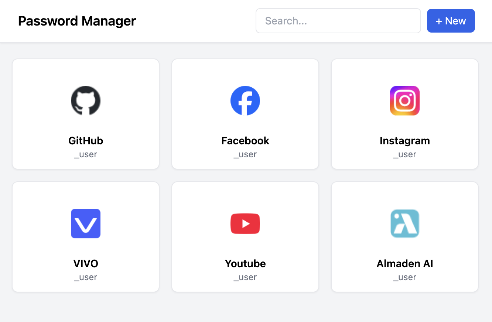
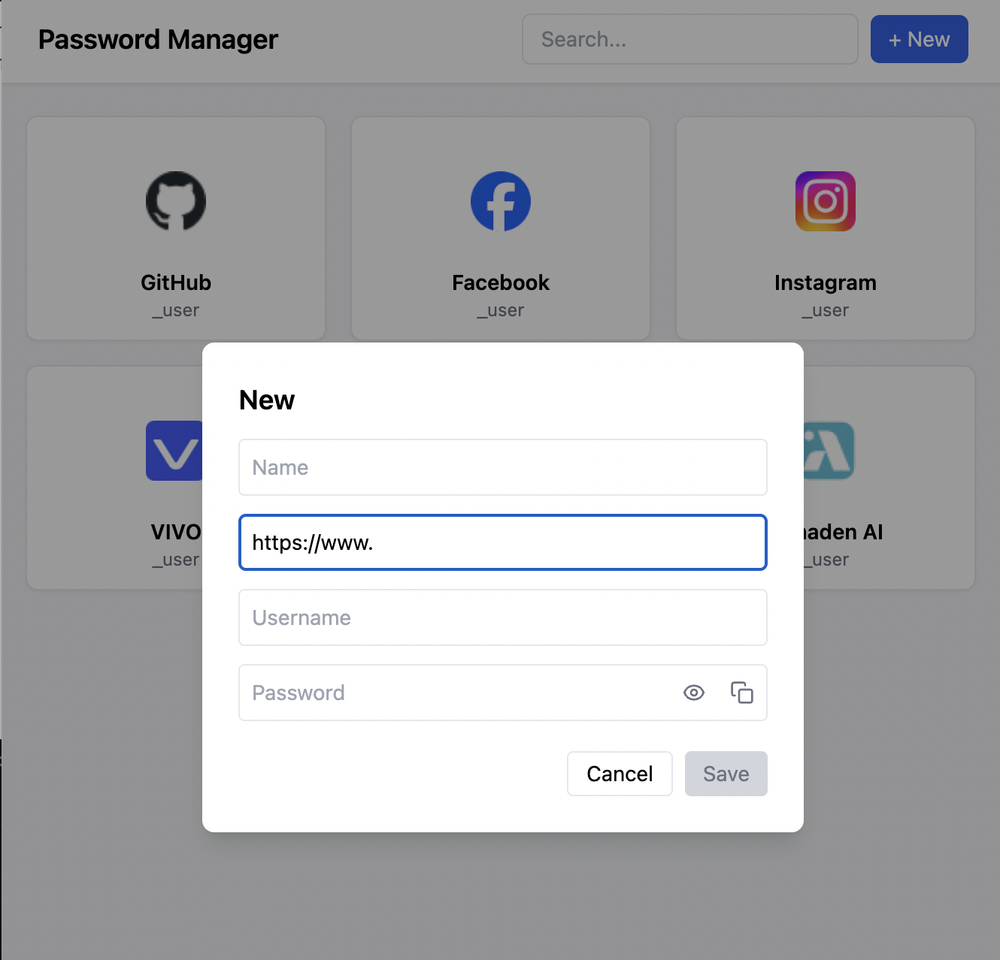

# PASSWORD MANAGER

A simple password management application built with Node.js and React.

Author: Roberto Ayres Pimenta

**Password Manager**

This project is a simple password management application that allows users to store and organize login credentials for different websites and applications.

## Running the Project

To start the project for the first time, run:

<pre class="overflow-visible! px-0!" data-start="145" data-end="170">

npm run setup

</pre>

This command installs all dependencies and starts both the backend and frontend simultaneously.

For the next runs, you can simply use:

<pre class="overflow-visible! px-0!" data-start="309" data-end="330">

npm start

</pre>

This will start the backend and frontend without reinstalling dependencies.

## Technologies and Architecture

This project was developed using **Node.js** for the backend and **React** for the frontend.

- **Node.js** was chosen to provide a simple and efficient API layer for managing password cards.
- **React** was used to build a dynamic and component-based user interface.
- The project is divided into **backend** and **frontend** to keep responsibilities separated and improve maintainability.

This structure allows the application to scale more easily and keeps the codebase organized.

## Tech Stack

- Node.js (With express, due to the simplicity of the project.)
- React/Vite
- TypeScript
- Express

## Screenshots

#### Home

  

<h4>New

  

